##  DenseFeaturesNet: a single image dehazing network with refined transmission estimation and local atmospheric light prediction

The proposed DenseFeaturesNet exploits the pretrained DenseNet-121 to generate favorable representative features of hazy image, applies two decoders for jointly forecasting the transmission map and global atmospheric light, and finally requires the dehazed image through a refinement module.<br /><br />
Inorder to strength the dehaze ability on remote scene, the method applies a specific synthesis procedure utilizing refined depth images, the WMSE derived from transmission map for loss computation, and a local estimation method for enhancing the applicability of dehazing in real life.

<p align='center'>
  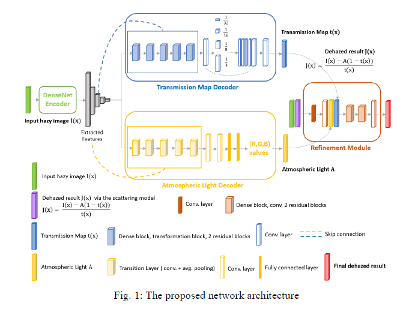
</p>


### Prerequisites
* python 3
* PyTorch >= 1.0
* numpy
* matplotlib
* tensorboardX(optional)

### Datasets
The synthetic datasets are available from [the download link](https://drive.google.com/drive/folders/1KINGcryTuqsaG-mH5ZDn9vFSDXs0kA7J?usp=sharing)
#### Training:
Images synthesized utilizing `NYU Depth V2` and `OTS` of [RESIDE](https://sites.google.com/view/reside-dehaze-datasets/)<br />
* nyu_ots_haze_uniform_train2 : training dataset
* nyu_ots_haze_uniform_val2 : valditation dataset

#### Testing:
`12 benchmark images` and `SOTS` of [RESIDE](https://sites.google.com/view/reside-dehaze-datasets/)<br />
* real_haze: 12 compared real hazy images
* SOTS_indoor: 500 synthetic indoor hazy images
* SOTS_outdoor: 500 synthetic outdoor hazy images
* nyu_ots_haze_uniform_test2 : testing dataset
* real_haze_other: other real hazy images

### Procedure of Data Synthesis
<p align='center'>
  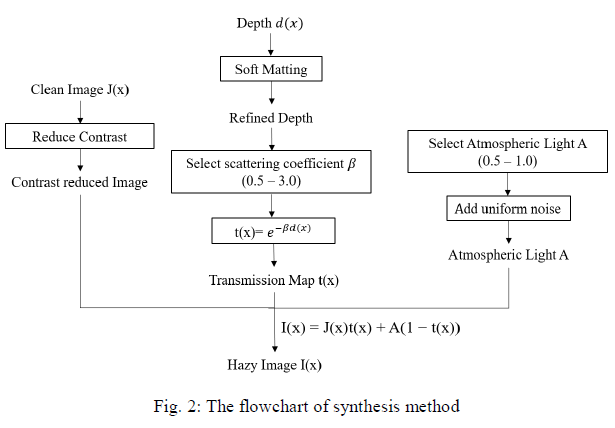
</p>
 
<p align='center'>
  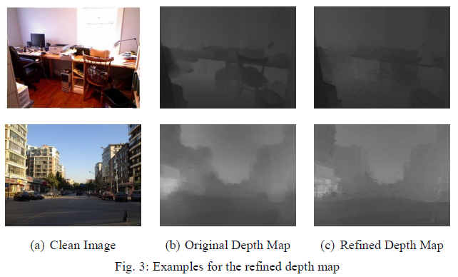
</p>

<p align='center'>
  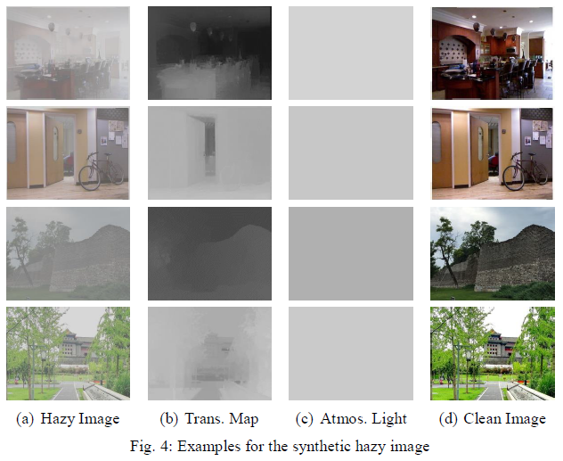
</p>

### Usage

#### Training:

 ```shell
python train_final.py --fix_first_conv_blocks --bn_no_track_stats
 ```

#### Testing:
* The pretrained model is available from [the download link](https://drive.google.com/drive/folders/1p5GgCZjH9YDlaeX4jIRsKEtQ3dEIPgfG?usp=sharing)<br />
Put the pretrained weight in the `current folder`.<br />
The testing .ipynb files are in `final dehazing result folders`. ( including global and local estimation method)<br />

<p align='center'>
  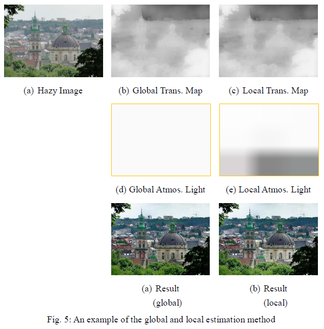
</p>

### Evaluation on Real Hazy Images
&nbsp; &nbsp; &nbsp; The results of previous works are generated from the programs provided by the authors.<br />
For the paper without a given code, the program written by a third party will be executed for evaluation.<br />
Thus, the comparison results may different from the results directly produced by the authors.

#### Result folders:
* result0728_exp3_real_haze
* result0803_exp3_real_haze_other
* result0803_exp3_sots_indoor  [link](https://drive.google.com/drive/folders/1xuzxDlmfQmtomreVrVLRyHQ9BnXw4Xmz?usp=sharing)
* result0803_exp3_sots_outdoor  [link](https://drive.google.com/drive/folders/1xuzxDlmfQmtomreVrVLRyHQ9BnXw4Xmz?usp=sharing)

#### Dehazed results for comparing with state-of-the-arts:
* ref_papers_with_result ( folder contains 12 compared results)
[link](https://drive.google.com/drive/folders/1xzt7yKqCDT0esINoj1F4JqkCxZYGzToZ?usp=sharing)

<p align='center'>
  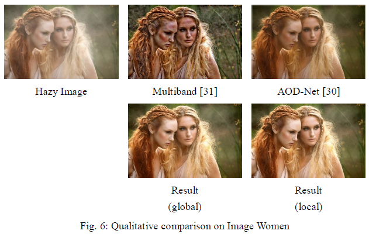
</p>

<p align='center'>
  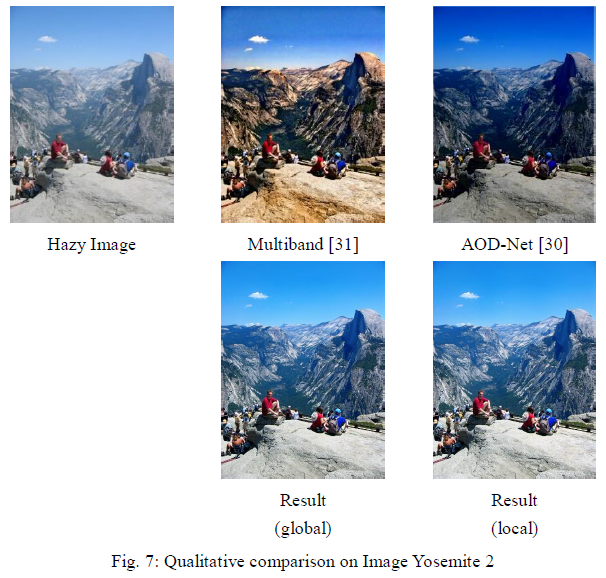
</p>

<p align='center'>
  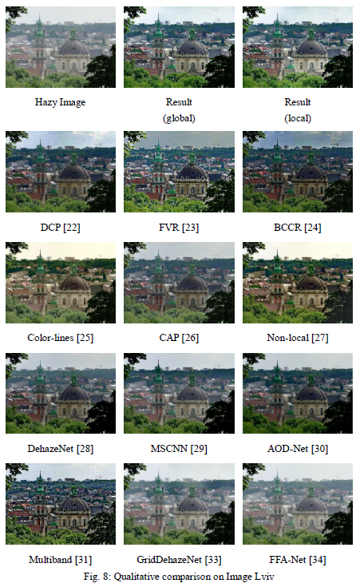
</p>

<p align='center'>
  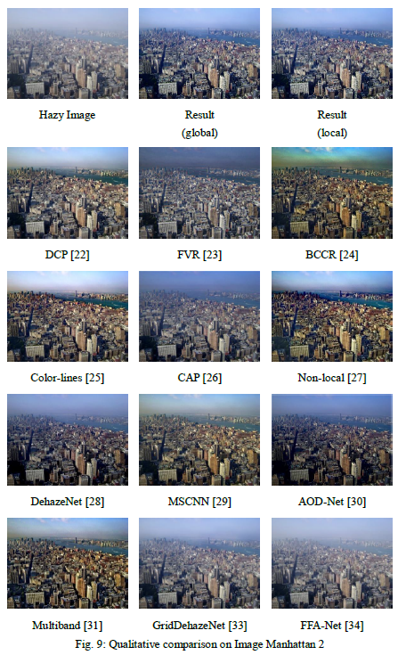
</p>

<p align='center'>
  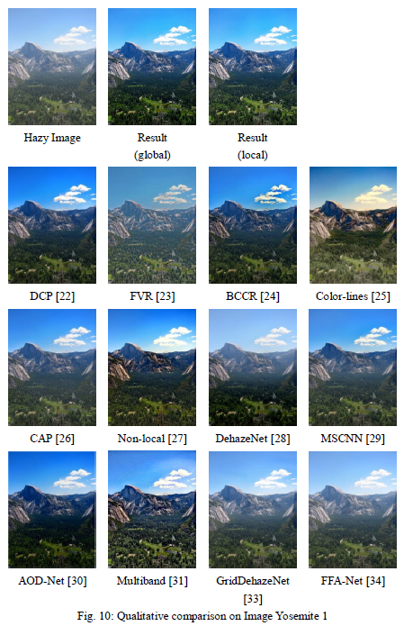
</p>

<p align='center'>
  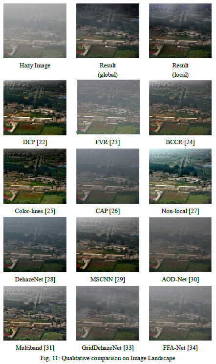
</p>
 <figcaption style="text-align:center">Qualitative comparsion on Image Landscape</figcaption>

### Evaluation on Synthetic Hazy Images

#### Quantitative comparsion on SOTS Indoor/Outdoor Dataset
|Methods|Indoor(PSNR/SSIM)|Outdoor(PSNR/SSIM)|
|:-:|:-:|:-:|
|DCP|16.62/0.8179|19.13/0.8148|
|DehazeNet|21.14/0.8472|22.46/0.8514|
|AOD-Net|19.06/0.8504|20.29/0.8765|
|GridDehazeNet|32.16/0.9836|30.86/0.9819|
|FFA-Net|36.39/0.9886|33.57/0.9840|
|**DenseFeaturesNet**|**24.51**/**0.9130**|**24.95**/**0.9321**|

#### Comparsion on SOTS Indoor Dataset with different configurations
|Methods|Result using formula(PSNR/SSIM)|Result after refinement module(PSNR/SSIM)|
|:-:|:-:|:-:|
|local estimation|23.06/0.8981|20.87/0.8993|
|global estimation|**24.51**/0.9130|22.29/**0.9188**|

#### Comparsion on SOTS Outdoor Dataset with different configurations
|Methods|Result using formula(PSNR/SSIM)|Result after refinement module(PSNR/SSIM)|
|:-:|:-:|:-:|
|local estimation|22.96/0.9375|22.89/0.9303|
|global estimation|24.10/**0.9364**|**24.95**/0.9321|


